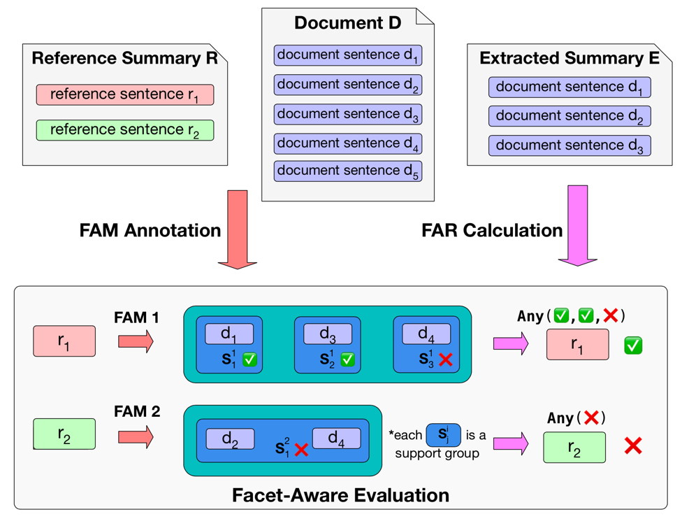
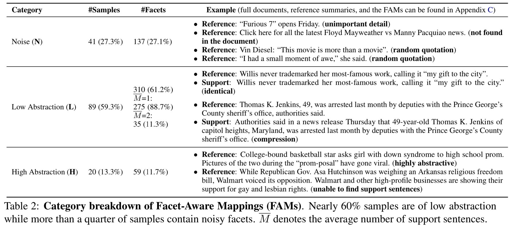

# Facet-Aware Evaluation for Extractive Summarization
We provide the annotated data and self-contained evaluation scripts for the paper "Facet-Aware Evaluation for Extractive Summarization" [[Paper]]( https://arxiv.org/abs/1908.10383) [[Slides & Talk]](https://virtual.acl2020.org/paper_main.445.html), ACL 2020.


## Abstract

Commonly adopted metrics for extractive summarization focus on lexical overlap at the token level. In this paper, we present a facet-aware evaluation setup for better assessment of the information coverage in extracted summaries. Specifically, we treat **each sentence in the reference summary as a facet**, identify the **sentences in the document that express the semantics of each facet as** **support sentences** of the facet, and automatically evaluate extractive summarization methods by **comparing the indices of extracted sentences and support sentences** of all the facets in the reference summary. To facilitate this new evaluation setup, we construct an extractive version of the CNN/Daily Mail dataset and perform a thorough quantitative investigation, through which we demonstrate that facet-aware evaluation manifests better correlation with human judgment than ROUGE, enables fine-grained evaluation as well as comparative analysis, and reveals valuable insights of state-of-the-art summarization methods.


## Example



Each facet (reference sentence) is mapped to a list of support groups, where each group consists of one or multiple support sentences. The semantics of one facet is covered as long as one of the support groups is covered.

In the example above, Facet 1 (r1) is covered because document sentence d1/d3 is extracted, but r2 is not covered since d4 is not extracted.


## Category Breakdown

We analyzed 150 samples on the CNN/Daily Mail dataset and found that around 1/4 contain noise, and 60% are of low abstraction (suitable for extraction).




## Code Instructions

`facet_aware_eval.ipynb` illustrates how to use the annotated data for facet-aware evaluation. The raw extracted summaries are first mapped back to sentence indices and then compared with the indices of support sentences.

`data/*` contains files used in the notebook demo.

`output/*` contains human-readable plain text of the annotation results.


## Citation

Please cite the following paper if you use our data. Thank you!

```
@inproceedings{mao-etal-2020-facet,
    title = "Facet-Aware Evaluation for Extractive Summarization",
    author = "Mao, Yuning  and
      Liu, Liyuan  and
      Zhu, Qi  and
      Ren, Xiang  and
      Han, Jiawei",
    booktitle = "Proceedings of the 58th Annual Meeting of the Association for Computational Linguistics",
    month = jul,
    year = "2020",
    address = "Online",
    publisher = "Association for Computational Linguistics",
    url = "https://www.aclweb.org/anthology/2020.acl-main.445",
    pages = "4941--4957",
}
```
